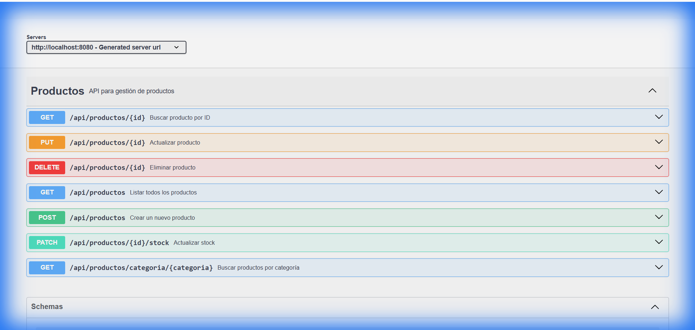
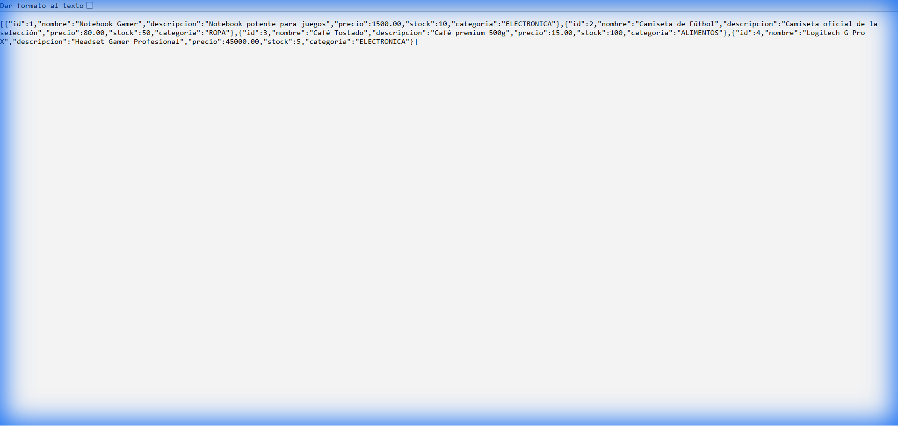
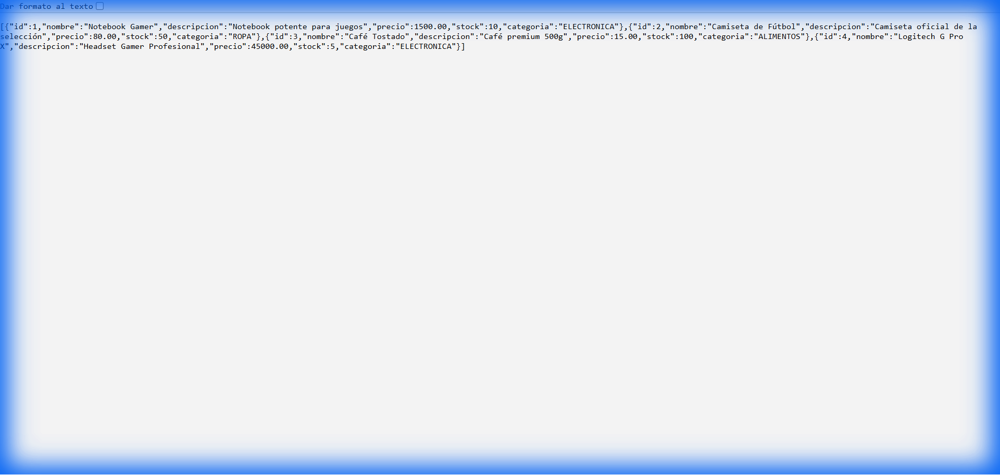

# API REST de Productos

**Materia:** Programación III  
**Alumno:** Lautaro Salinas  
**Legajo:** 52834  
**Universidad Tecnológica Nacional (UTN)**

---

## Descripción

Este proyecto es una API REST desarrollada con Spring Boot 3 para la gestión de productos de un e-commerce. Permite realizar operaciones CRUD completas (Crear, Leer, Actualizar, Eliminar) sobre productos, con validaciones robustas, manejo de excepciones centralizado y documentación automática mediante Swagger.

La aplicación utiliza una base de datos H2 en memoria, lo que facilita las pruebas sin necesidad de configurar un motor de base de datos externo. Está diseñada siguiendo principios de Clean Architecture y SOLID, con una clara separación de responsabilidades en capas (Controller, Service, Repository, DTO, Exception).

---

## Tecnologías Utilizadas

- **Java 17** - Lenguaje de programación
- **Spring Boot 3.2.3** - Framework principal
- **Spring Data JPA** - Capa de persistencia
- **H2 Database** - Base de datos en memoria
- **Lombok** - Reducción de código boilerplate
- **Hibernate Validator** - Validaciones de datos
- **SpringDoc OpenAPI (Swagger)** - Documentación automática de la API
- **Maven** - Gestión de dependencias y construcción del proyecto

---

## Estructura del Proyecto

```
com.utn.productos
├── controller       # Controladores REST (endpoints)
├── service          # Lógica de negocio
├── repository       # Acceso a datos (JPA)
├── model            # Entidades JPA
├── dto              # Data Transfer Objects
└── exception        # Manejo global de excepciones
```

---

## Endpoints de la API

| Método | Ruta                                | Descripción                                    |
|--------|-------------------------------------|------------------------------------------------|
| POST   | `/api/productos`                    | Crear un nuevo producto                        |
| GET    | `/api/productos`                    | Listar todos los productos                     |
| GET    | `/api/productos/{id}`               | Obtener un producto por ID                     |
| GET    | `/api/productos/categoria/{categoria}` | Filtrar productos por categoría             |
| PUT    | `/api/productos/{id}`               | Actualizar un producto completo                |
| PATCH  | `/api/productos/{id}/stock`         | Actualizar solo el stock de un producto        |
| DELETE | `/api/productos/{id}`               | Eliminar un producto                           |

### Categorías Disponibles
- `ELECTRONICA`
- `ROPA`
- `ALIMENTOS`
- `HOGAR`
- `DEPORTES`

---

## Instrucciones de Ejecución

### Requisitos Previos
- Java 17 o superior instalado
- Maven 3.6+ instalado

### Pasos para Ejecutar

1. **Clonar el repositorio** (o descomprimir el archivo del proyecto):
   ```bash
   cd ApiRest
   ```

2. **Ejecutar la aplicación con Maven**:
   ```bash
   mvn spring-boot:run
   ```

3. **Acceder a la aplicación**:
   - **API Base URL**: [http://localhost:8080](http://localhost:8080)
   - **Swagger UI**: [http://localhost:8080/swagger-ui.html](http://localhost:8080/swagger-ui.html)
   - **Consola H2**: [http://localhost:8080/h2-console](http://localhost:8080/h2-console)

### Configuración de la Consola H2

Para acceder a la base de datos desde la consola web:

- **JDBC URL**: `jdbc:h2:mem:productosdb;DB_CLOSE_DELAY=-1`
- **User Name**: `sa`
- **Password**: *(dejar vacío)*

---

## Capturas de Pantalla

### Swagger UI - Documentación Interactiva


### Creación de Producto (POST)


### Listado de Productos (GET)


### Error 404 - Producto No Encontrado


### Error 400 - Validación Fallida


### Consola H2 - Datos en la Base de Datos


---

## Ejemplos de Uso

### Crear un Producto (POST)

**Request:**
```bash
curl -X POST http://localhost:8080/api/productos \
-H "Content-Type: application/json" \
-d '{
  "nombre": "Notebook Gamer",
  "descripcion": "Potente notebook para juegos",
  "precio": 1500.00,
  "stock": 10,
  "categoria": "ELECTRONICA"
}'
```

**Response (201 Created):**
```json
{
  "id": 1,
  "nombre": "Notebook Gamer",
  "descripcion": "Potente notebook para juegos",
  "precio": 1500.00,
  "stock": 10,
  "categoria": "ELECTRONICA"
}
```

### Listar Todos los Productos (GET)

**Request:**
```bash
curl http://localhost:8080/api/productos
```

### Actualizar Stock (PATCH)

**Request:**
```bash
curl -X PATCH http://localhost:8080/api/productos/1/stock \
-H "Content-Type: application/json" \
-d '{"stock": 20}'
```

---

## Validaciones Implementadas

La API incluye validaciones estrictas en los DTOs:

- **Nombre**: No puede estar vacío, debe tener entre 3 y 100 caracteres
- **Descripción**: Máximo 500 caracteres
- **Precio**: Debe ser mayor a 0.01
- **Stock**: No puede ser negativo (mínimo 0)
- **Categoría**: Debe ser una de las categorías válidas

---

## Manejo de Errores

La aplicación implementa un manejo centralizado de excepciones mediante `@ControllerAdvice`:

- **404 Not Found**: Cuando se busca un producto que no existe
- **400 Bad Request**: Cuando los datos de entrada no cumplen las validaciones
- **500 Internal Server Error**: Para errores inesperados del servidor

Todas las respuestas de error incluyen:
- Timestamp
- Mensaje descriptivo
- Ruta del endpoint

---

## Conclusiones Personales

Durante el desarrollo de este trabajo práctico, pude comprender la importancia de aplicar una arquitectura en capas bien definida. La separación entre Controller, Service y Repository no solo hace que el código sea más mantenible, sino que también facilita las pruebas unitarias y la evolución del proyecto.

El uso de DTOs fue fundamental para desacoplar la capa de presentación de la capa de persistencia, evitando exponer directamente las entidades JPA y permitiendo un control más fino sobre qué datos se envían y reciben en cada endpoint. Esto también mejora la seguridad al prevenir la exposición accidental de campos sensibles.

La integración de Swagger/OpenAPI resultó ser una herramienta invaluable, ya que no solo genera documentación automática y actualizada, sino que también proporciona una interfaz interactiva para probar los endpoints sin necesidad de herramientas externas como Postman. Esto acelera significativamente el proceso de desarrollo y debugging.

Finalmente, el manejo global de excepciones mediante `@ControllerAdvice` demostró ser una práctica esencial para proporcionar respuestas consistentes y profesionales ante errores, mejorando la experiencia del consumidor de la API.

---

## Autor

**Lautaro Salinas**  
Legajo: 52834  
Universidad Tecnológica Nacional (UTN)  
Programación III - 2025
